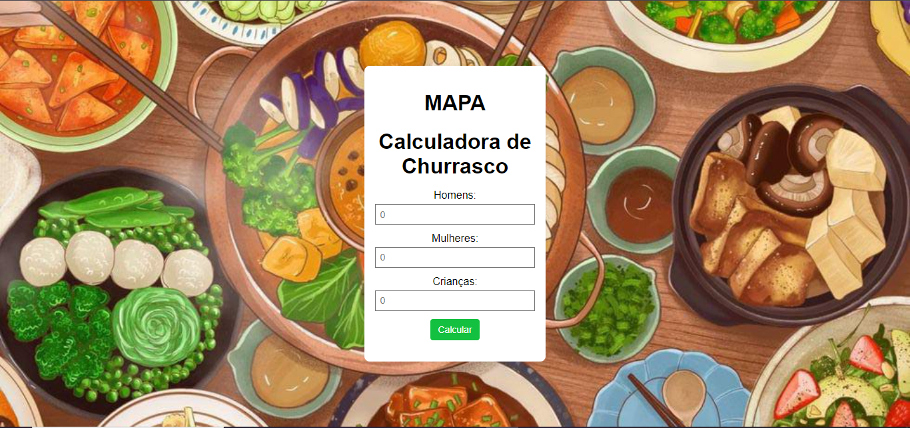
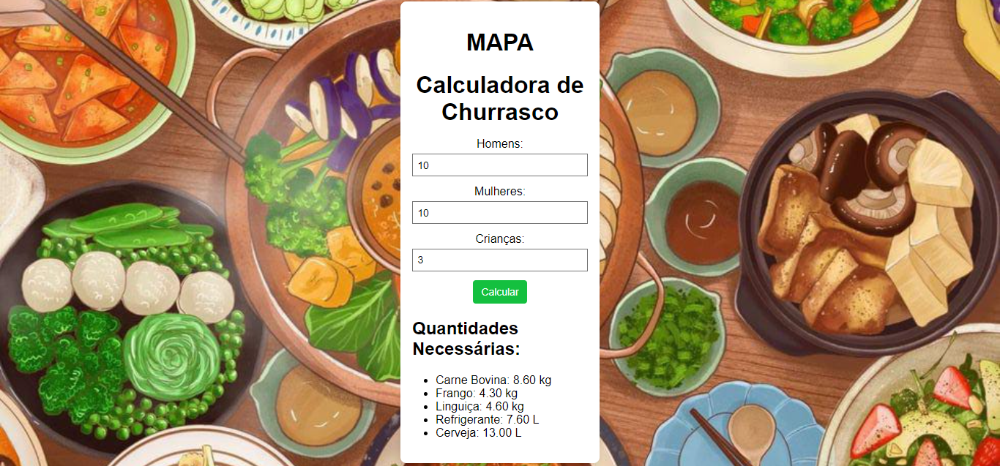

# 🚀 Projeto: Calculadora de Churrasco 🥩🍗

### Estou animada em compartilhar minha atividade MAPA do curso de ADS! Uma *Calculadora de Churrasco* para estimar a quantidade de carne, frango, linguiça, refrigerante e cerveja necessária para eventos, com base no número de homens, mulheres e crianças participantes.

   *Layout da atividade*
  
  

# Tecnologias Utilizadas:

# Funcionalidades:
- *Entrada de Dados*: Insira o número de homens, mulheres e crianças.
- *Cálculo Automático*: Calcula as quantidades necessárias de cada item.
- *Interface Interativa*: Atualiza os resultados instantaneamente.

🔗 [Link do projeto ](https://saramarinho4.github.io/calculadora-de-churrasco/) 
